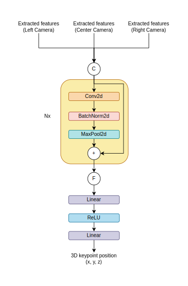
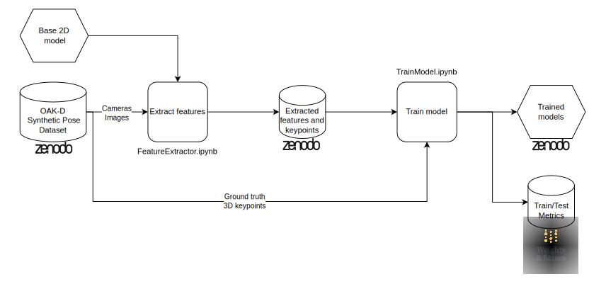
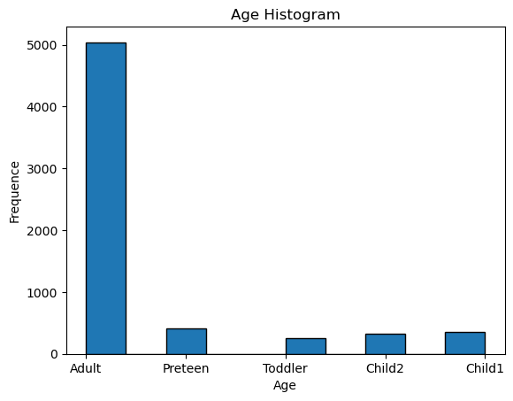

# `Estimação Estéreo de Pose Corporal 3D`
# `3D Stereo Body Pose Estimation`

## Apresentação

O presente projeto foi originado no contexto das atividades da disciplina de pós-graduação *IA904 - Projeto de Modelos em Computação Visual*, 
oferecida no primeiro semestre de 2024, na Unicamp, sob supervisão da Profa. Dra. Leticia Rittner e da Profa. Paula D. Paro Costa, ambas do Departamento de Engenharia de Computação e Automação (DCA) da Faculdade de Engenharia Elétrica e de Computação (FEEC).

Nome|RA|Curso
-|-|-
Elton Cardoso do Nascimento|233840|Mestrado em Engenharia Elétrica - Área de Concentração AE: Engenharia de Computação
Leonardo Rener de Oliveira|201270|Mestrado em Engenharia Elétrica - Área de Concentração AE: Engenharia de Computação

## Descrição do Projeto

Estimação de pose corporal é uma técnica amplamente utilizada em diversas indústrias como cinema e jogos, e se baseia na detecção de keypoints específicos no corpo de uma pessoa. Pode ser realizada desde utilizando equipamentos mais complexos e custosos como sistemas de mocap (motion capture), quanto por sensores mais simples como IMU (unidades de medição inercial), ou, utilizando IA (inteligência artificial), usando imagens de câmeras [1][2].

Mais especificamente, dentro do contexto universitário, é comum a necessidade de coletas simples de poses corporais, seja para testar e validar ideias em projetos de pesquisa, seja para realização de projetos de disciplina. Este tipo de demanda se beneficiaria de um método de coleta rápido e com pouca preparação, não necessitando de uma precisão tão grande quanto sistemas de mocap, como coleta a partir de imagens.

O objetivo deste projeto é então estimar a posição corporal no espaço 3D de uma pessoa, utilizando uma câmera estéreo (dipositivo com várias câmeras). Mais especificamente, este projeto utilizará uma "OAK-D", dipositivo desenvolvido para aplicações de visão computacional que possui três câmeras, duas laterais monocromáticas, global shutter e 720p; e uma central colorida, rolling shutter e 4K. A câmera se comunica com o computador através de um cabo USB-C, e também possui integrado processadores para execução de pipelines de processamento visual e IA [3].

## Métodos
Nossa proposta é utilizar um modelo detector de keypoints 2D pronto e utilizá-lo como um extrator de features, removendo as últimas camadas, executando-o uma vez em cada entrada e concatenado as features obtidas, que serão usadas de entrada para uma rede treinável que deverá estimar as posições dos pontos no espaço 3D. O treino será realizado de forma supervisionada. Serão exploradas arquiteturas densas e CNNs.

A avaliação será quantitativa com os dados sintéticos, comparando a solução obtida com o ground truth e a triangularização. A avaliação será no espaço métrico 3D, visto que desejamos estimar de fato a posição absoluta de cada junta, e utilizando como métrica a soma do erro quadrático médio (MSE) de cada keypoint. Entre aspectos não determinados, keypoints não disponíveis em nenhuma das 3 imagens poderão ser mascarado; e como métrica alternativa pensamos em explorar o erro absoluto médio (MAE), para diminuir problemas com outliers. Para comparação, utilizaremos uma triangularização não-linear.

Arquitetura proposta:



## Bases de Dados

Base de Dados | Endereço na Web | Resumo descritivo
-|-|-
OAK-D Synthetic Pose|[OAK-D Synthethic Pose Dataset ](https://doi.org/10.5281/zenodo.12212762) |Dataset de imagens sintéticas com avatares realizando diferentes poses. Sintetizado para simular a captura com uma OAK-D. Contém anotação de keypoints 2D e 3D.

Os dados utilizados foram sintetizados utilizando o motor de jogos Unity, que possui desenvolvido o pacote "Perception" para a geração de dados sintéticos [4]. Ele simula a configuração do dispositivo real e aplican randomizações que julgarmos necessárias, tentando mitigar os efeitos da mudança do domínio virtual para real. Para a geração de "pessoas virtuais" utilizamos o pacote "SyntheticHumans" [5].

Foram realizadas as randomizações: 
- Geração procedural de "pessoas virtuais"
- Pose da pessoa virtual
- Posicionamento da pessoa virtual
- Posicionamento, rotação, textura e hue de objetos (ruído)
- Câmera
  - Pose relativa entre as câmeras
  - Foco
  - Tamanho do sensor
  - Abertura
  - Lens shift

Cada entrada no conjunto de dados será composto de três imagens, uma para cada câmera, com apenas uma pessoa em cena e keypoints no espaço 2D e 3D anotados para cada câmera. 

O dataset é divivido nos seguintes conjuntos:

Nome do conjunto | Nome explicativo | Tipo | Descrição
-|-|-|-
Scenario0|Fixed|Treino|Parâmetros da câmera fixos
Scenario1|WeakNormal|Treino|Parâmetros da câmera com randomização aditiva fraca e normalmente variada
Scenario2|StrongNormal|Treino|Parâmetros da câmera com randomização aditiva forte e normalmente variada
Scenario3|StrongUniform|Teste|Parâmetros da câmera com randomização aditiva fraca e uniformemente variada
Scenario4|Fixed-Test|Teste|Parâmetros da câmera fixos

Uma descrição mais detalhada do protocolo de geração pode ser obtido em [OAK-D Synthetic Pose Dataset Generation Protocol](https://github.com/EltonCN/IA904-2024S1/blob/7b13886703576c74ecca8f1b1dd751d36a8c1896/projetos/3DStereoBodyPoseEstimation/data/OAK-D%20Synthetic%20Pose%20Dataset%20Generation%20Protocol.pdf).

O código do gerador de dados pode está disponível no repositório [IA904-3D_Pose](https://github.com/EltonCN/IA904-3D_Pose).

Para o uso durante treino, o dataset é divido em 3 conjuntos:

Conjunto de treino | Conjuntos do dataset pertencentes
-|-
0 | Scenario0
1 | Scenario0, Scenario1
2 | Scenario0, Scenario1, Scenario2

## Ambiente Computacional

O ambiente computacional utilizado foi:

- Hardware
  - RTX 2060 6 GB
  - 20 GB RAM
- Software
  - Pytorch 2.2.1
  - MMPose 1.3.1
  - Windows 10
  - Python 3.8

Devido ao custo de memória para carregar os dados durante o treino, a GPU não é totalmente utilizada, sendo provavelmente possível treinar os modelos criados com uma GPU menos rápida sem grandes perdas de performance.

## Workflow

- Geração de dados sintéticos

- Treino do modelo

- Coleta de dados reais

- Avaliação


## Avaliação

Utilizamos o framework ["Metrics Reloaded"](https://metrics-reloaded.dkfz.de/) para tentar levantar possíveis métricas para o projeto. Porém, obtivemos que o nosso projeto está fora do escopo do framework, pois nossa categoria de problema (posições 3D de keypoints extraídas a partir de imagens) não é prevista por ele. Dito isso não pudemos obter métricas relevantes a partir dele.

Decidimos utilizar como métricas o erro quadrático médio (MSE) e erro absoluto médio (MAE), considerando que os erros que queremos avaliar se encontram diretamente em um espaço geométrico 3D, sendo direto o que estas métricas simbolizam. Em especial, consideramos o uso do MAE divido a sua característica de lidar melhor com outliers, embora essa característica não foi avaliada durante o projeto pelos problemas que serão relatados.

Outras métricas para avaliar corretude de esqueletos poderiam ser utilizadas, porém consideramos como mais relevante a posição espacial em si do keypoint, visto que sua corretude gera uma corretude no nível do esqueleto.

## Experimentos e Resultados

### Dataset

O dataset construído está disponibilizado no Zenodo: [OAK-D Synthethic Pose Dataset
 ](https://doi.org/10.5281/zenodo.12212762).

Inicialmente, realizamos uma análise do dataset para avaliar possíveis vieses. Para isso, plotamos histogramas relevantes, que podem ser visualizados a seguir.

|  |  |
|----------|----------|
|  |  |
|  |  |


Observamos que o dataset apresenta um bom balanceamento em relação a características como altura, peso, etnia e sexo. Possuindo distribuições uniformes e abrangendo diferentes faixas de valores. No entanto, identificamos um desequilíbrio na distribuição por idade. A maioria dos dados está concentrada em faixas etárias adultas, o que pode afetar a generalização do modelo para outras faixas etárias.

### Treino

As métricas de treino dos modelos podem ser visualizadas no projeto [IA904-OAKD3DKeypoint](https://wandb.ai/eltoncn/IA904-OAKD3DKeypoint?nw=nwusereltoncn) no "Weights and Biases".

É possível baixar os modelos treinados utilizando:

```python
import wandb
run = wandb.init()
artifact = run.use_artifact('eltoncn/IA904-OAKD3DKeypoint/model:VERSION', type='model')
artifact_dir = artifact.download()
```

Trocando "VERSION" pela versão do modelo ("0_mse", "0_mae", "1_mse", "1_mae", "2_mse", "2_mae").

### Avaliação

A partir das métricas dos modelos treinados nos datasets, obtivemos os resultados:

Média da perda dos modelos em relação a métrica utilizada durante o treino:


Média da perda dos modelos em todos os cenários (não ponderada pelo tamanho do cenário):


Todas as perdas dos modelos, por cenário. Células acima da linha azul significa que é a perda em um conjunto utilizado durante o treino.


Exemplo de predição:


Os [gráficos gerados ](https://doi.org/10.5281/zenodo.12524909) e [métricas de avaliação](https://doi.org/10.5281/zenodo.12524683) foram disponibilizados no Zenodo.


## Discussão

Obsevando os resultados, poderíamos indicar que o uso da métrica "MSE" durante o treino gerou resultados melhores do que a métrica "MAE", mesmo ao cruzar as métricas na avaliação. Além disso, a randomização nos dados não gerou o resultado esperado, visto que os modelos possuem erros altos mesmo no dataset de teste sem randomização (4). Todos os erros são muito altos para a aplicação, com o menor erro médio sendo de 18 cm.

Porém, ao analisar novamente o código, em especial o [código do dataset](src/train/dataset.py)#120:

```python
keypoints_3d = df.iloc[[1]]["keypoints_3d"].values[0]
```

onde os keypoints para gerar o sample do dataset, ou seja, o target do modelo, é fixado para a segunda linha do dataset filtrado pelo cenário. Logo, o target do modelo está incorreto, invalidando as conclusões obtidas.


## Conclusão

Infelizmente, poucas conclusões podem ser obtidas dos treinos e modelos em si.

Entre aprendizados, conseguimos colocar em prática conceitos de reprodutibilidade como worflow e publicação de elementos utilizados (datasets e dados intermediários), assim como o datasheet. Entre ferramentas, pudemos aprender mais sobre o uso do "Weights and Biases", "Zenodo" e "MMPose". Ao construir e treinar o modelo, aprendemos sobre a construção de uma CNN com conexão residual, e a lidar com a paralelização da leitura dos dados no dataset.

As dificuldades principais são relacionadas ao cronograma do projeto, que se mostrou de difícil execução durante o tempo proposto. Limitações de hardware também geraram problemas durante o treinamento do modelo.


## Trabalhos Futuros

A maior prioridade de um trabalho futuro seria a correção do código para repetir o treino dos modelos.

Após isso, outros trabalhos futuros incluem:
- Refinamento dos hiperparâmetros de treino
- Exploração de outras arquiteturas para o modelo
- Uso de dados além dos heatmaps
- Normalização dos dados
- Captura do dataset real para avaliação
- Implementação de avaliação comparativa com triangularização


## Referências
[1] Zheng, Ce, et al. "Deep learning-based human pose estimation: A survey." ACM Computing Surveys 56.1 (2023): 1-37.

[2] Kumar, Pranjal, Siddhartha Chauhan, and Lalit Kumar Awasthi. "Human pose estimation using deep learning: review, methodologies, progress and future research directions." International Journal of Multimedia Information Retrieval 11.4 (2022): 489-521.

[3] “OAK-D — DepthAI Hardware Documentation 1.0.0 documentation.” Acesso em: 12 de maio de 2024. [Online]. Disponível em: https://docs.luxonis.com/projects/hardware/en/latest/pages/BW1098OAK/

[4] S. Borkman et al., “Unity Perception: Generate Synthetic Data for Computer Vision”. arXiv, 19 de julho de 2021. doi: 10.48550/arXiv.2107.04259.

[5] “Unity-Technologies/com.unity.cv.synthetichumans: A package for creating Unity Perception compatible synthetic people.” Acesso em: 12 de maio de 2024. [Online]. Disponível em: https://github.com/Unity-Technologies/com.unity.cv.synthetichumans