# `Análise de tomates em diferentes estágios de maturação utilizando biospeckle e deep learning`
# `Analysis of tomatoes at different ripening stages using biospeckle and deep learning`

## Apresentação

O presente projeto foi originado no contexto das atividades da disciplina de pós-graduação *IA904 - Projeto de Modelos em Computação Visual*, 
oferecida no primeiro semestre de 2024, na Unicamp, sob supervisão da Profa. Dra. Leticia Rittner e da Profa. Paula D. Paro Costa, ambas do Departamento de Engenharia de Computação e Automação (DCA) da Faculdade de Engenharia Elétrica e de Computação (FEEC).


|Nome  | RA | Curso|
|--|--|--|
| Chen Jiahao  | 195673  | Graduação em Engenharia Elétrica |
| Juan Felipe Serighelli | 219148  | Mestrado em Engenharia Mecânica |


## Descrição do Projeto
O projeto consiste em analisar o biospeckle de um tomate para estimarmos o seu estágio de maturação utilizando uma rede neural convolucional. O biospeckle é uma ferramenta de análise óptica não destrutiva de materiais biológicos, quando o objeto é iluminado por um feixe de luz "espalhado por uma superfície com rugosidades da ordem do comprimento de onda incidente ocorre a formação de uma estrutura granular no espaço livre à qual é dado o nome de speckle"(Silva, E. R. da ., & Muramatsu, M., 2007, p 283–286).

<figure>
    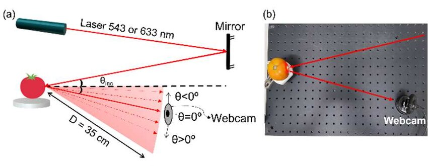
    <figcaption>"(a) Assembly diagram for biospeckle capture of tomato using 633 nm and543 nm lasers. The beam is parallel to the table and with an incident angle of 19.5º. The angle of specular reflection was defined as θ = 0º. Negative angles are between the specular reflection and the incident beam (-19.5º, -13º, and -6.5º), while positive angles of theta are beyond the reflected specular reflection (6.5º and 13º). (b) Photo of the central part of the setup showing a representation of the laser beam, biological sample, and webcam."(J. F. Serighelli, E. Fujiwara and C. M. B. Cordeiro, 2023, pp. 1-2)</figcaption>
</figure>

É de interesse para a pesquisa, a classificação de maturação de tomates de maneira automatizada evita uso de técnicas analíticas e estatísticas, otimizando tempo de ensaios laboratoriais e análise de dados.

Na área de alimentos, a classificação de maturação garante o controle de qualidade dos frutos usados na produção industrial (usar tomates na maturação certa).

## Metodologia
A principal metodologia a ser seguida será com base em [[3]](#3), no qual foi realizado o treinamento de uma rede neural para classificação de speckles de diferentes comprimentos de onda com o objetivo de verificar a eficácia do uso de deep learning para identificação de padrões em medição via speckle.

O artigo conclui que o uso de redes neurais são ideais para estas análises pois conseguem identificar e extrair detalhes relevantes presente nos dados uma vez que a tarefa mais difícil na medição por speckle não se trata de obter a medição mas sim analisá-la pois depende da interpretação e entendimento da variação dos padrões vistos no input. 

Na publicação [[1]](#1) o uso de Biospeckle se mostrou um novo método eficaz de avaliação de frutos pois não é destrutivo e é mais preciso sendo menos sujeito a uma mera análise por cor por ser capaz de quantificar a atividade biológica do fruto.

Dito isso, podemos então reaproveitar a metodologia utilizada nos artigos anteriores desta vez ao invés de classificar comprimentos de onda, iremos classificar o dia de maturação de um tomate do momento da sua colheita até trigésimo dia de maturação utilizando o biospeckle do tomate e seus respectivos dias de maturação e uma rede neural treinada por deep learning para identificar os padrões correspondentes ao dia de maturação. Em relação ao dis de maturação, será feito testes com dois método de rotular o dataset:

Método 1:
 * 6 períodos: dia 0 a 1/ dia 2 a 3/ dia 4 a 5/ dia 7 a 9/ dia 11 a 17/ dia 24 a 31

Método 2:
 * 3 classes: verde(dia 0 a 3), maduro(dia 4 a 9) e senescente(dia 11 a 31)

Os modelos utilizados serão:
 * Modelo baseado no VGG16, com menos layers de convolução e downsize no tamanho das camadas FC

Assim como no artigo de R. K. Gupta, iremos avaliar os modelos com base na acurácia, F1-score e pela sua matriz de confusão.

## Bases de Dados


Base de Dados | Datasheet |  Resumo descritivo
----- | ----- | -----
Dataset pessoal de Juan |  [Estrutura do dataset](./data/tomate_dataset.csv)<br /> [Estrutura do subset](./data/small_tomate_dataset.csv) | Acervo pessoal de iniciação científica realizada em 2023, acervo composto de vídeos que serão extraídos os frames em formato jpg de tamanho 480x640.

<figure>
    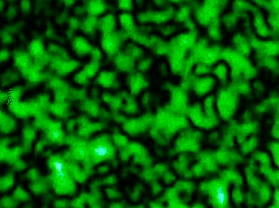
    <figcaption>Biospeckle com laser verde </figcaption>
</figure>


<figure>
    
    <figcaption>Biospeckle com laser vermelho </figcaption>
</figure>


## Ambiente computacional
As principais ferramentas utilizadas neste projeto:
 * Google Drive
 * PyTorch
 * Google Colab
 * scikit-learn

Todos os testes foram feitos pelo ambiente de desenvolvimento da Google, utilizando-se da plataforma do Google Drive para manusear o Dataset e de scripts no Google Colab para extração de frames e rotulação dos dados.

## Workflow

<figure>
    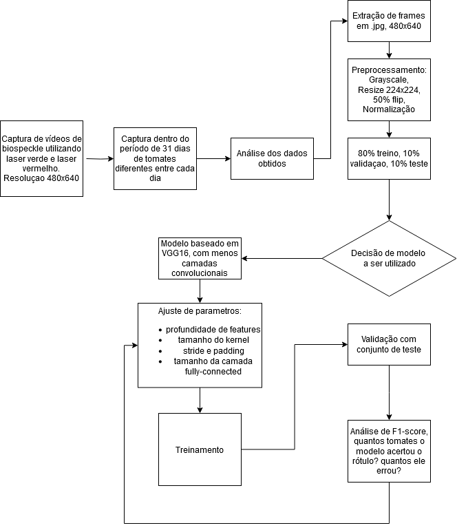
    <figcaption>Fluxograma </figcaption>
</figure>

## Avaliação

No problema da classificação dos tomates dado o contexto de controle de qualidade na produção industrial de alimentos, é de grande interesse identificar corretemente os estágios de maturação do tomate e evitar falsos negativos e falsos positivos visando a qualidade correta da produção.

Portanto, as métricas a serem escolhidas devem ser relevantes ao contexto citado acima, desta forma decide-se por: Recall, precision e F1-score pois são métricas que avaliam os principais pontos, de falso positivo e falso negativo.

Além disso, como é bem provável que os períodos de classificaçao se sobreponham entre si, o uso de matriz de confusão permite a identificação de períodos que possam estar na intersecção entre uma classe e outra.

## Experimentos e Resultados

Foram feitos x experimentos, utilizando dois métodos de rótular o dataset e dois modelos de CNN

### Model V1:

```
----------------------------------------------------------------
        Layer (type)               Output Shape         Param #
================================================================
            Conv2d-1         [-1, 16, 112, 112]             416
       BatchNorm2d-2         [-1, 16, 112, 112]              32
              ReLU-3         [-1, 16, 112, 112]               0
         MaxPool2d-4           [-1, 16, 56, 56]               0
            Conv2d-5           [-1, 32, 56, 56]           4,640
       BatchNorm2d-6           [-1, 32, 56, 56]              64
              ReLU-7           [-1, 32, 56, 56]               0
         MaxPool2d-8           [-1, 32, 28, 28]               0
            Conv2d-9           [-1, 64, 28, 28]          18,496
      BatchNorm2d-10           [-1, 64, 28, 28]             128
             ReLU-11           [-1, 64, 28, 28]               0
        MaxPool2d-12           [-1, 64, 14, 14]               0
          Dropout-13                [-1, 12544]               0
           Linear-14                 [-1, 4096]      51,384,320
             ReLU-15                 [-1, 4096]               0
          Dropout-16                 [-1, 4096]               0
           Linear-17                 [-1, 4096]      16,781,312
             ReLU-18                 [-1, 4096]               0
           Linear-19                    [-1, 6]          24,582
            Model-20                    [-1, 6]               0
================================================================
Total params: 68,213,990
Trainable params: 68,213,990
Non-trainable params: 0
----------------------------------------------------------------
```

### Model V2:

```
----------------------------------------------------------------
        Layer (type)               Output Shape         Param #
================================================================
            Conv2d-1          [-1, 4, 112, 112]             304
       BatchNorm2d-2          [-1, 4, 112, 112]               8
              ReLU-3          [-1, 4, 112, 112]               0
         MaxPool2d-4            [-1, 4, 56, 56]               0
            Conv2d-5            [-1, 8, 28, 28]             808
       BatchNorm2d-6            [-1, 8, 28, 28]              16
              ReLU-7            [-1, 8, 28, 28]               0
         MaxPool2d-8            [-1, 8, 14, 14]               0
            Conv2d-9             [-1, 16, 7, 7]           3,216
      BatchNorm2d-10             [-1, 16, 7, 7]              32
             ReLU-11             [-1, 16, 7, 7]               0
        MaxPool2d-12             [-1, 16, 4, 4]               0
          Dropout-13                  [-1, 256]               0
           Linear-14                  [-1, 128]          32,896
             ReLU-15                  [-1, 128]               0
          Dropout-16                  [-1, 128]               0
           Linear-17                   [-1, 64]           8,256
             ReLU-18                   [-1, 64]               0
           Linear-19                    [-1, 6]             390
            Model-20                    [-1, 6]               0
================================================================
Total params: 45,926
Trainable params: 45,926
Non-trainable params: 0
```

### Método 1

Neste método foi utilizado o dataset rodulado por períodos a cada 2 dias

#### Model V1

Teste inicial feito com o primerio modelo, neste teste vemos que o modelo conseguiu predizer a classe 0 e 1 sem falhas porém nos casos 3 e 5 o modelo errou 100% e para as classes 2 e 4 teve alto índice de falsos positivos, principalmente na classe 4 que são os dias 11-17 pois houve confusão com o range da classe 3 dos dias 07-09.

Neste treinamento a acurária estagnou em 67% logos nas primeiras épocas, não tendo aumento dela posteriormente.

Resultados:

<figure>
    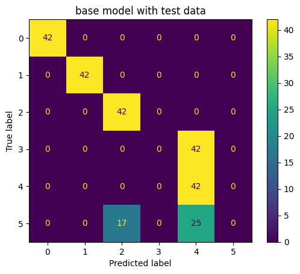
    <figcaption>Resultado do modelo V1 pelo método 1</figcaption>
</figure>

```
              precision    recall  f1-score   support

           0       1.00      1.00      1.00        42
           1       1.00      1.00      1.00        42
           2       0.71      1.00      0.83        42
           3       0.00      0.00      0.00        42
           4       0.39      1.00      0.56        42
           5       0.00      0.00      0.00        42

    accuracy                           0.67       252
```

#### Model V2

Para solucionar o problema de estagnação durante o treinamento, foi reduzido o tamanho das camadas. Porém o resultado obtido foi de um modelo com overfitting. Vemos que o modelo atingiu 100% de acurácia com o conjunto de testes.

Resultados:
<figure>
    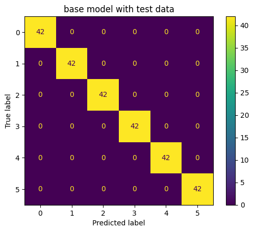
    <figcaption>Resultado do modelo V2 pelo método 1</figcaption>
</figure>

```
              precision    recall  f1-score   support

           0       1.00      1.00      1.00        42
           1       1.00      1.00      1.00        42
           2       1.00      1.00      1.00        42
           3       1.00      1.00      1.00        42
           4       1.00      1.00      1.00        42
           5       1.00      1.00      1.00        42

    accuracy                           1.00       252
```

#### Comparaçao entre Model V1 e V2 utilizando dataset 2.

Analisando o dataset utilizado no treinamento, é possível que ele esteja contaminado pois o conjunto de testes é proveniente do mesmo dataset. Desta forma foi utilizando um segundo dataset que não passou pelo treinamento para poder obter métricas reais dos dois modelos.

##### Model V1 com Conjunto 2
Resultados:
<figure>
    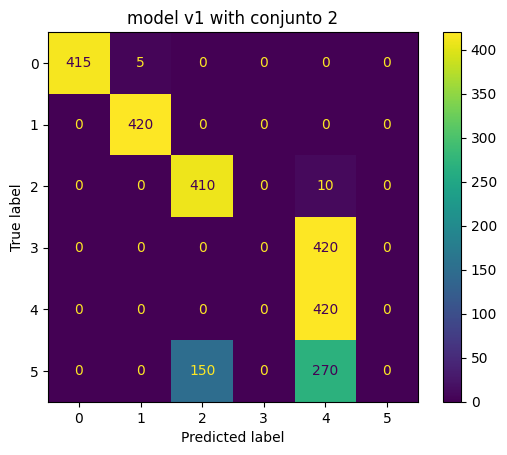
    <figcaption>Resultado do modelo V1 pelo método 1 com conjunto 2</figcaption>
</figure>

```
              precision    recall  f1-score   support

           0       1.00      0.99      0.99       420
           1       0.99      1.00      0.99       420
           2       0.73      0.98      0.84       420
           3       0.00      0.00      0.00       420
           4       0.38      1.00      0.55       420
           5       0.00      0.00      0.00       420

    accuracy                           0.66      2520
```

##### Model V2 com Conjunto 2
Resultados:

<figure>
    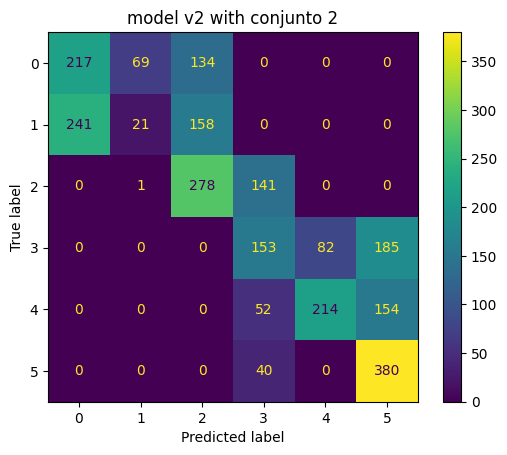
    <figcaption>Resultado do modelo V2 pelo método 1 com conjunto 2</figcaption>
</figure>


```
              precision    recall  f1-score   support

           0       0.47      0.52      0.49       420
           1       0.23      0.05      0.08       420
           2       0.49      0.66      0.56       420
           3       0.40      0.36      0.38       420
           4       0.72      0.51      0.60       420
           5       0.53      0.90      0.67       420

    accuracy                           0.50      2520
```

Dado os resultados acima, observe-se que o modelo 1 com o conjunto 2 apesar de ter a maior acurácia, o F1-score dele é muito baixo pois o model V1 errou completamente as classes 3 e 5 igual ao teste feito com o dataset de teste.

Já no modelo 2, apesar dele estar com overfitting ao testar com o conjunto 2 vemos que a acurácia dele é de 50% com uma boa distribuição de F1-Score com exceção da classe 1, e observa-se pela matriz de confusão que o modelo 2 conseguiu passar de fato por um treinamento efetivo pois vê-se que há proximidade entre as predições, não tendo ocorrências muito distantes entre si, isto é, falso negativo na classe 2 visto no resultado do modelo v1.

### Método 2
Neste método, o conjunto de dados foi rotulado entre verde(dia 0 a dia 3), maduro(dia 4 a dia 9) e senescente(dia 11 a dia 31).

As etapas de teste para este método foram as mesmas do método anterior, inclusive foram feitas de maneira simultânea.

#### Model V1

Como neste método possui menos classes, alto índice de falso negativo é mais grave que o método anterior e neste caso como se pode observar abaixo, o modelo 1 classificou toda a classe 1 como 0, desta forma é um erro grave a ser corrigido.

Resultados:

<figure>
    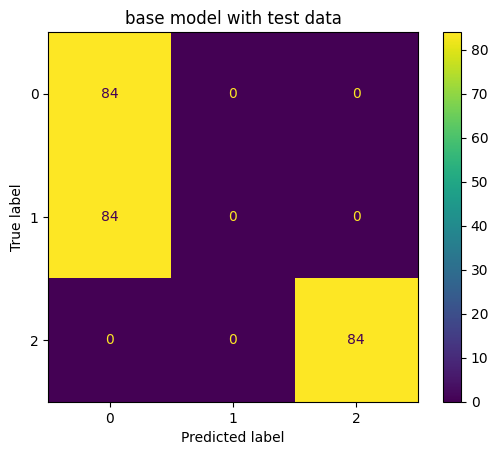
    <figcaption>Resultado do modelo V1 pelo método 2</figcaption>
</figure>

```
              precision    recall  f1-score   support

           0       0.50      1.00      0.67        84
           1       0.00      0.00      0.00        84
           2       1.00      1.00      1.00        84

    accuracy                           0.67       252
```

#### Model V2

Da mesma forma que o método 1, o modelo V2 tem alta tendência a overfitting necessitando mais ajustes no modelo. Entretanto da mesma forma, o a acurácia de 100% demorou a ser atingida, diferente do modelo V1 que atingiu 67% em poucas épocas e estagnou.

Resultados:

<figure>
    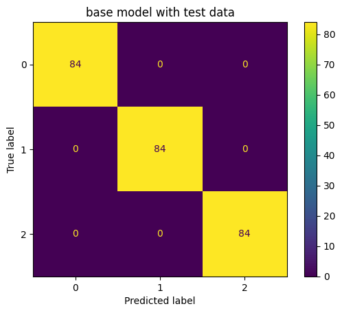
    <figcaption>Resultado do modelo V2 pelo método 2</figcaption>
</figure>


```
              precision    recall  f1-score   support

           0       1.00      1.00      1.00        84
           1       1.00      1.00      1.00        84
           2       1.00      1.00      1.00        84

    accuracy                           1.00       252
```

#### Comparaçao entre Model V1 e V2 utilizando dataset 2.

Como visto anteriormente Model V2, apesar do overfitting, se destacou mais quando submetido a um segundo conjunto de dados, podemos ver que o mesmo resultado é obtido para o método 2

##### Model V2 com Conjunto 2

Resultados:

<figure>
    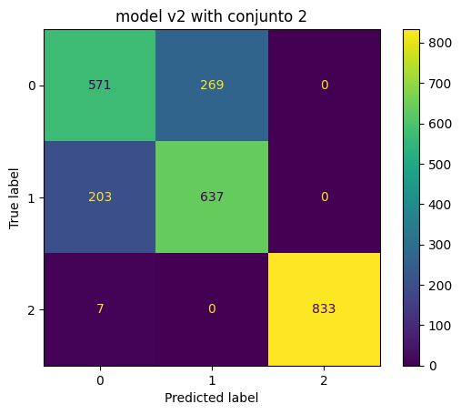
    <figcaption>Resultado do modelo V2 pelo método 2</figcaption>
</figure>


```
              precision    recall  f1-score   support

           0       0.73      0.68      0.70       840
           1       0.70      0.76      0.73       840
           2       1.00      0.99      1.00       840

    accuracy                           0.81      2520
```

#### Model V2 em RGB com Conjunto 2

Por fim foi feito um teste sem o pré-processamento para grayscale a fim de comparar o resultado anterior


<figure>
    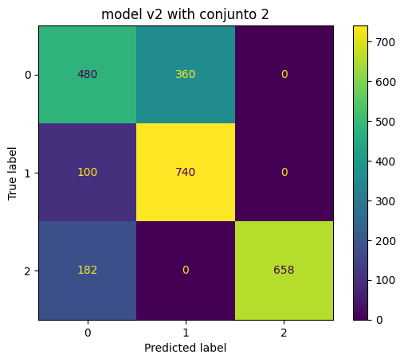
    <figcaption>Resultado do modelo V2 pelo método 2</figcaption>
</figure>


```
              precision    recall  f1-score   support

           0       0.63      0.57      0.60       840
           1       0.67      0.88      0.76       840
           2       1.00      0.78      0.88       840

    accuracy                           0.75      2520
```

Note que a acurácia de ambos os testes com e sem RGB são próximas. Percebe-se que com cores o modelo V2 consegue identificar um pouco melhor se o tomate está maduro, já em cinza o modelo V2 consegue identificar muito bem se o tomate está senescente.

#### Discussão

Vemos pelos resultados anteriores que determinar a forma de se rotular o conjunto de dados pode impactar em como o modelo deve ser avaliado. Inicialmente esperava-se classificar por dia específico porém dado o contexto industrial de produção, não há necessidade de tamanha precisão de dia possibilitando a redução do escopo de classes para 6 ou 3 classes.

Dos experimentos feitos, ao utilizar o método 2 se mostrou muito mais vantajoso pois nele compacta-se os estágios de maturação comumente utilizados que são verde, maduro e senescente. Além disso, a utilização ou não dos canais de cores se mostrou capaz de impactar na predição do modelo, visto que o uso de cinza melhora a predição de senescente e o uso de RGB melhora a predição de maduro em detrimento de maior índice de falsos negativos.

Por fim, dos resultados obtidos, ainda necessita de mais estudo em relação ao uso do modelo correto e definir claramente o que se espera extrair como característica da imagem.

## Conclusão

Com base na discussão dos resultados, destaca-se a importância do conhecimento no tratamento de dados, isto é, análise, rotulação e pré-processamento. Das métricas utilizadas para avaliar os modelos, podemos concluir que foram eficazes pois a partir delas foi possível identificar onde o modelo precisava ser ajustado.

Além disso o uso em conjunto das métricas se mostrou eficaz visto que pode se obter informações relevantes pela matriz de confusão para identificar a proximidade dos falsos negativos e falsos positivos dos verdadeiros positivos.

Por se tratar de grandes estruturas de código e diversas configurações de experimento, mostrou-se um grande desafio a organizaçao de projeto e definiçao de um worlflow além das horas restritas de uso do ambiente gratuito do Google Colab.

## Trabalhos futuros

Para trabalhos futuros, sugere-se:

 * Uso de mais técnicas de data augmentation, foram utilizadas poucas técnicas
 * Testar modelos de classificação diferentes como por exemplo SVM
 * Estudo da melhor maneira de se rotular o conjunto de dados, isto é, o período adequado entre verde, maturaçao e senescente
 * Obter conjunto de dados com maior diversidade de tomates
## Referências
<a id="1">[1]</a> J. F. Serighelli, E. Fujiwara and C. M. B. Cordeiro, "Quantitative Biospeckle Spectral and Angular Analysis of Tomatoes at Different Ripening Stages," 2023 International Conference on Optical MEMS and Nanophotonics (OMN) and SBFoton International Optics and Photonics Conference (SBFoton IOPC), Campinas, Brazil, 2023, pp. 1-2, doi: https://doi.org/10.1109/OMN/SBFotonIOPC58971.2023.10230977.

<a id="2">[2]</a> Silva, E. R. da ., & Muramatsu, M.. (2007). O fenômeno do speckle como introdução à metrologia óptica no laboratório didático. Revista Brasileira De Ensino De Física, 29(2), 283–286. https://doi.org/10.1590/S0102-47442007000200013

<a id="3">[3]</a>  R. K. Gupta, G. D. Bruce, S. J. Powis, K. Dholakia, Deep Learning Enabled Laser Speckle Wavemeter with a High Dynamic Range. Laser & Photonics Reviews 2020, 14, 2000120. https://doi.org/10.1002/lpor.202000120

<a id="4">[4]</a>  https://medium.com/@trapti.kalra/why-traditional-cnns-may-fail-for-texture-based-classification-3b49d6b94b6f