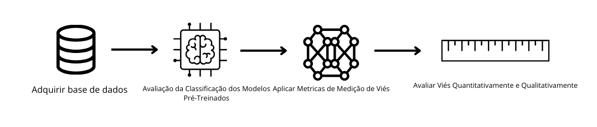
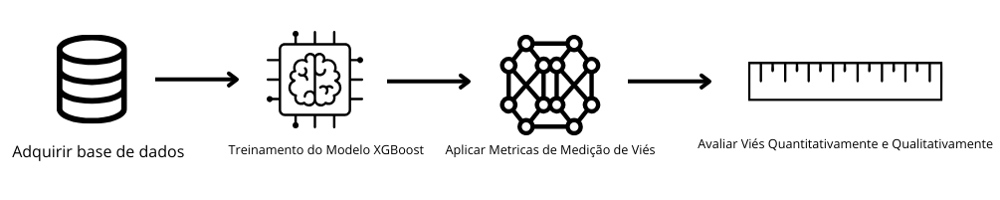

# `Desvendando Viés: Uma Análise dos Algoritmos de Imagem e Detecção Facial`
# `Unraveling Bias: An Analysis of Image and Facial Detection Algorithms`

## Apresentação

O presente projeto foi originado no contexto das atividades da disciplina de pós-graduação *IA904 - Projeto de Modelos em Computação Visual*, 
oferecida no primeiro semestre de 2024, na Unicamp, sob supervisão da Profa. Dra. Leticia Rittner e da Profa. Paula D. Paro Costa, ambas do Departamento de Engenharia de Computação e Automação (DCA) da Faculdade de Engenharia Elétrica e de Computação (FEEC).

Segue tabela com as informações dos alunos do projeto:

|Nome  | RA | Curso|
|--|--|--|
| Leonardo Vilela de Abreu Silva Pereira | 220198 | Aluno Especial |
| Sílvia Claudino Martins Gomes | 271629 | Aluna Especial |

## Descrição do Projeto
O viés racial em modelos de detecção e reconhecimento facial é a tendência de desempenho desigual com base na raça das pessoas, devido a desequilíbrios nos dados de treinamento e padrões discriminatórios nos algoritmos. Identificar o viés envolve avaliar o desempenho em diferentes grupos raciais, analisar os conjuntos de dados e investigar os algoritmos utilizados.

O projeto visa compreender o viés racial em modelos amplamente reconhecidos na literatura. Para este estudo, será utilizada uma base de dados de imagens de rostos de pessoas de diversas etnias, denominada FairFace. Serão aplicados modelos de visão computacional populares na comunidade de processamento de imagens para serem comparados. Espera-se, ao final do projeto, compreender quais modelos apresentam melhor desempenho em relação ao viés racial.

Para alcançar este objetivo de detecção de viés iremos primeiramente analisar os embeddings das imagens utilizando ferramentas de redução de dimensionalidade como t-SNE (*t-distributed Stochastic Neighbor Embedding*) ou UMAP (*Uniform Manifold Approximation and Projection*) e, neste espaço reduzido, verificar como a rede separa diversas etnias. 

Realizamos, também, uma análise na literatura de métricas de viés, como paridade demográfica, igualdade de oportunidades,etc... Estas métricas são essenciais para compreender melhor como o desempenho dos modelos varia entre diferentes grupos raciais e para identificar potenciais áreas de discriminação.

Para a análise dessas métricas, selecionamos alguns modelos populares de detecção facial (MTNCC, Blaze Face e Retina Face), utilizando o dataset mencionado na seção de dataset. O MTNCC (Multi-Task Cascaded Convolutional Networks) é conhecido por sua eficácia em detecção facial multitarefa. Blaze Face é um modelo leve e rápido, frequentemente usado em aplicações móveis, enquanto Retina Face é aclamado por sua precisão em reconhecimento facial robusto. Esses modelos serão avaliados para identificar disparidades de desempenho entre diferentes grupos étnicos, proporcionando uma visão abrangente das limitações e potencialidades dos modelos em termos de equidade racial.

## Metodologia
Nesta seção, será delineada a metodologia adotada para investigar o viés na distribuição dos embeddings das redes de imagens em relação à raça, utilizando técnicas de redução de dimensionalidade como t-Distributed Stochastic Neighbor Embedding (t-SNE) ou Uniform Manifold Approximation and Projection (UMAP). Além disso iremos delinear como será feito o treinamento e análise de viés no modelo de XGBoost que tentará prever o sexo da pessoa dado o embedding da face e como iremos fazer o comparativo dos modelos mais famosos de detecção facial (MTNCC, Blaze Face e Retina Face).

No que diz respeito ao pré-processamento, prevemos realizar poucas ou nenhuma modificação nos dados, uma vez que nosso objetivo é analisar o comportamento dos modelos e identificar quais hiperparâmetros precisam ser ajustados para mitigar o viés racial em cada um deles. Também planejamos aumentar o conjunto de dados utilizando diversas técnicas de aumento de dados, garantindo o equilíbrio das etnias representadas no conjunto. 

Esse enfoque permitirá a avaliação dos melhores modelos e metrificação do viés por métodos já utilizados na literatura.

As métricas utilizadas serão:
- Paridade Demográfica 
- Igualdade de Oportunidade
- Igualdade de Chance
- Paridade Preditiva
- Igualdade de Tratamento 

## Bases de Dados e Evolução
A base de dados que será utilizada será a [FairFace](https://github.com/joojs/fairface). Um conjunto de dados de atributos faciais para raças, gêneros e idades equilibrados. Durante este projeto, só serão utilizados os rótulos de raça. [1] Serão apresentados três exemplos de imagens presentes entre os dados e os respectivos rótulos:

  

    
    
Idade: 50-59  Gênero: Male  Raça: Middle Eastern

  

  

    
    
Idade: 0-2 Gênero: Male Raça: Black

  

  

    
    
Idade: 20-29 Gênero: Female Raça: Southeast Asian

  

O conjunto é conhecido por realizar um bom balanceamento entre as diversas etnias presentes no conjunto como é possível visualizar na imagem a seguir:

A base de dados possui dois conjuntos separados, um composto para o treino, com 86744 imagens, e o outro composto para a validação, com 10954 imagens. Além do gráfico, podemos analisar os dados de balanceamento através da tabela a seguir, com a quantidade de imagens para cada etnia no conjunto de treino e validação.

|Etnia  | Treino | Validação |
|--|--|--|
| White | 16527 | 2085 |
| Latino Hispanic | 13367 | 1623 |
| Indian | 12319 | 1556 |
| East Asian | 12287 | 1550 |
| Black | 12233 | 1516 |
| Southeast Asian | 10795 | 1415 |
| Middle Eastern | 9216 | 1209 |

A seguir, será apresentado um resumo em forma de tabela com as principais informações da base de dados.

Base de Dados | Endereço na Web | Resumo descritivo
----- | ----- | -----
FairFace | https://github.com/dchen236/FairFace | Um conjunto de dados de atributos faciais para raças, gêneros e idades equilibrados. [1]

## Ferramentas

Serão apresentadas a seguir as ferramentas e bibliotecas a serem utilizadas durante o projeto.

Biblioteca principal:
- PyTorch

Modelos utilizados para geração dos embeddings:
- FaceNet
- BlazeFace
- MTNCC
- Retina Face

Redução de dimensionalidade:
- t-Distributed Stochastic Neighbor Embedding (t-SNE) 
- Uniform Manifold Approximation and Projection (UMAP)

Avaliação de modelos:
- Paridade Demográfica 
- Igualdade de Oportunidade
- Igualdade de Chance
- Paridade Preditiva
- Igualdade de Tratamento 

Cálculo de métricas:
- Fairlearn

Ambiente computacional:
- Visual Studio Code
- Python 3.12

## Workflow

  

    
    
Workflow para os modelos  pré-treinados 

  

  

    
    
Workflow para XGBoost

  

## Avaliação

### Etapa 1: Problem Fingerprinting
O problema escolhido pelo grupo foi a avaliação de viés racial em modelos de detecção de rostos, como MTCNN, BlazeFace e RetinaFace. Este problema se encaixa na categoria de viés e equidade em algoritmos de aprendizado de máquina, especificamente em modelos de visão computacional. Mapear o problema de viés racial é crucial para entender como diferentes grupos raciais, particularmente indivíduos negros, são impactados por modelos de detecção de rostos. Viés racial pode levar a discriminação tecnológica, em que modelos não desempenham de maneira justa para todas as raças, causando impactos negativos significativos.

### Etapa 2: Metric Selection
Após estudos, foram vistos que as seguintes métricas se enquadram no problema de verificação de viés descrito:

1. **Paridade Demográfica**: Mede se a taxa de previsões positivas é a mesma entre diferentes grupos raciais. Com isso, torna-se possível garantir que a frequência de detecções de rosto seja semelhante entre indivíduos negros e outros grupos raciais. Isso é fundamental para evitar discriminação.
2. **Igualdade de Oportunidade**: Avalia se a taxa de verdadeiros positivos (detecções corretas) é igual entre diferentes grupos raciais. Focar na igualdade de verdadeiros positivos assegura que a precisão do modelo ao detectar rostos reais seja justa entre os grupos raciais.
3. **Igualdade de Chance**: Verifica se a taxa de falsos negativos (rostos não detectados) é igual entre diferentes grupos raciais. É importante para garantir que a falha em detectar rostos não seja sistematicamente maior para indivíduos negros, evitando a exclusão desse grupo.
4. **Paridade Preditiva**: Examina se a probabilidade de uma detecção ser correta é igual entre diferentes grupos raciais. Com isso, busca assegurar que, ao ser detectado um rosto, a confiança nessa detecção ser correta seja equitativa entre todos os grupos raciais.
5. **Igualdade de Tratamento**: Avalia se o modelo trata cada entrada (imagem de rosto) da mesma forma, independente da raça. Esta métrica ajuda a garantir que o processo de detecção não seja influenciado pela raça, promovendo um tratamento justo e imparcial.

### Etapa 3: Metric Application
Implementação e Justificativas:

1. **Paridade Demográfica**:

Implementação: Calcular a taxa de detecções de rostos para cada grupo racial e comparar as taxas.
Interpretação: Se a taxa de detecção para indivíduos negros for significativamente menor, isso indicaria viés racial explícito.

2. **Igualdade de Oportunidade**:

Implementação: Comparar a taxa de verdadeiros positivos (TPR) entre diferentes grupos raciais.
Interpretação: Diferenças significativas na TPR indicariam que o modelo é menos preciso para determinados grupos raciais.

3. **Igualdade de Chance**:

Implementação: Comparar a taxa de falsos negativos (FNR) entre diferentes grupos raciais.
Interpretação: Uma maior FNR para indivíduos negros indicaria uma maior probabilidade de falhas na detecção de rostos negros, sinalizando viés.

4. **Paridade Preditiva**:

Implementação: Analisar a probabilidade preditiva positiva (PPV) para diferentes grupos raciais.
Interpretação: Se a PPV for menor para indivíduos negros, isso indicaria que as detecções são menos confiáveis para esse grupo.

5. **Igualdade de Tratamento**:

Implementação: Avaliar se o modelo aplica os mesmos critérios de detecção para todas as entradas, independente da raça.
Interpretação: Divergências no tratamento das entradas podem indicar um viés no processo de detecção, sugerindo necessidade de ajustes no modelo.

## Experimentos e Resultados
Para os experimentos, foram avaliados três modelos principais: MTCNN (*Multi-task Cascaded Convolutional Networks*), Blaze Face e Retina Face. Os experimentos foram com base no artigo "Are Face Detection Models Biased?" [4]. Os códigos para gerar os resultados estão na pasta *notebooks* deste repositório.

### MTCNN

Inicialmente, foi aplicado o modelo MTCNN para 2000 imagens de cada raça do conjunto de dados. Foi realizada essa limitação devido ao poder computacional do computador, visto que o código demorava horas para rodar. Com isso, obteve-se os seguintes resultados.

Não houveram erros na detecção de rostos das pessoas de raça branca, negra e do leste asiático. O único conjunto de imagens que houve um erro considerável foi do sudeste asiático. Em seguida, foi analisado o conjunto completo das raças branca e negra e obteve-se o seguinte resultado:

Pode-se observar que houve um número maior de erros para os rostos da raça branca. No entanto, existem mais imagens de pessoas dessa raça: 16527. Ja as pessoas da raça negra são representadas apenas por 12233 imagens. Com isso, é esperado que o primeiro conjunto apresente mais erros.

Em seguida, foram aplicados as métricas para avaliação de viés:

1. **Paridade Demográfica**:

| Race             | Selection Rate |
|------------------|----------------|
| Black            | 1.000000       |
| Indian           | 0.946996       |
| Latino Hispanic  | 0.970414       |
| Middle Eastern   | 0.919192       |
| Southeast Asian  | 0.952547       |
| White            | 1.000000       |

2. **Igualdade de Oportunidade**:

| Race             | True Positive Rate |
|------------------|--------------------|
| Black            | 1.000000           |
| Indian           | 0.942446           |
| Latino Hispanic  | 0.978261           |
| Middle Eastern   | 0.914062           |
| Southeast Asian  | 0.950820           |
| White            | 1.000000           |

3. **Igualdade de Chance**:

| Race             | Equalized Chance |
|------------------|------------------|
| Black            | 0.0              |
| Indian           | 0.0              |
| Latino Hispanic  | 0.0              |
| Middle Eastern   | 0.0              |
| Southeast Asian  | 0.0              |
| White            | 0.0              |

4. **Paridade Preditiva**:

| Race             | Predictive Parity |
|------------------|-------------------|
| Black            | 0.000000          |
| Indian           | 0.008943          |
| Latino Hispanic  | 0.013261          |
| Middle Eastern   | 0.014509          |
| Southeast Asian  | 0.003584          |
| White            | 0.000000          |

5. **Igualdade de Tratamento**:

| Race             | Equality of Treatment |
|------------------|-----------------------|
| Black            | 1.000000              |
| Indian           | 0.893835              |
| Latino Hispanic  | 0.943261              |
| Middle Eastern   | 0.842634              |
| Southeast Asian  | 0.905224              |
| White            | 1.000000              |

### Retina Face

Não houveram erros para a detecção de rostos utilizando o modelo Retina Face. Seguem as tabelas com os resultados das métricas:

1. **Paridade Demográfica**:

| Race             | Selection Rate |
|------------------|----------------|
| Black            | 1.0            |
| East Asian       | 1.0            |
| Indian           | 1.0            |
| Latino Hispanic  | 1.0            |
| Middle Eastern   | 1.0            |
| Southeast Asian  | 1.0            |
| White            | 1.0            |

2. **Igualdade de Oportunidade**:

| Race             | True Positive Rate |
|------------------|--------------------|
| Black            | 1.0                |
| East Asian       | 1.0                |
| Indian           | 1.0                |
| Latino Hispanic  | 1.0                |
| Middle Eastern   | 1.0                |
| Southeast Asian  | 1.0                |
| White            | 1.0                |

3. **Igualdade de Chance**:

| Race             | Equalized Chance |
|------------------|------------------|
| Black            | 0.0              |
| East Asian       | 0.0              |
| Indian           | 0.0              |
| Latino Hispanic  | 0.0              |
| Middle Eastern   | 0.0              |
| Southeast Asian  | 0.0              |
| White            | 0.0              |

4. **Paridade Preditiva**:

| Race             | Predictive Parity |
|------------------|-------------------|
| Black            | 0.0               |
| East Asian       | 0.0               |
| Indian           | 0.0               |
| Latino Hispanic  | 0.0               |
| Middle Eastern   | 0.0               |
| Southeast Asian  | 0.0               |
| White            | 0.0               |

5. **Igualdade de Tratamento**:

| Race             | Equality of Treatment |
|------------------|-----------------------|
| Black            | 1.0                   |
| East Asian       | 1.0                   |
| Indian           | 1.0                   |
| Latino Hispanic  | 1.0                   |
| Middle Eastern   | 1.0                   |
| Southeast Asian  | 1.0                   |
| White            | 1.0                   |

### Blaze Face

Já o modelo Blaze Face apresentou erros percentuais de forma equilibrada entre as raças. Como é possível visualizar na imagem a seguir:

Seguem as tabelas com os resultados das métricas:

1. **Paridade Demográfica**:

| Gender | Race             | Selection Rate |
|--------|------------------|----------------|
| Male   | Black            | 0.828536       |
|        | White            | 0.837790       |
|        | Latino Hispanic  | 0.849937       |

2. **Igualdade de Oportunidade**:

| Gender | Race             | True Positive Rate |
|--------|------------------|--------------------|
| Male   | Black            | 0.821809           |
|        | White            | 0.838961           |
|        | Latino Hispanic  | 0.844633           |

3. **Igualdade de Chance**:

| Gender | Race             | True Positive Rate | False Positive Rate |
|--------|------------------|--------------------|----------------------|
| Female | Black            | 0.890449           | 0.865337             |
|        | East Asian       | 0.923729           | 0.926014             |
|        | Indian           | 0.899471           | 0.909091             |
|        | Latino Hispanic  | 0.908616           | 0.888143             |
|        | Middle Eastern   | 0.893939           | 0.000000             |
|        | Southeast Asian  | 0.927419           | 0.935065             |
|        | White            | 0.879656           | 0.894137             |
| Male   | Black            | 0.821809           | 0.834515             |
|        | East Asian       | 0.882192           | 0.895631             |
|        | Indian           | 0.877841           | 0.847880             |
|        | Latino Hispanic  | 0.844633           | 0.854214             |
|        | Middle Eastern   | 0.885714           | 0.871495             |
|        | Southeast Asian  | 0.901961           | 0.904762             |
|        | White            | 0.838961           | 0.837178             |

4. **Paridade Preditiva**:

| Gender | Race             | Predictive Parity |
|--------|------------------|-------------------|
| Male   | White            | 0.001783          |
| Female | East Asian       | 0.002286          |
| Male   | Southeast Asian  | 0.002801          |

5. **Igualdade de Tratamento**:

| Gender | Race             | Equality of Treatment |
|--------|------------------|-----------------------|
| Female | Middle Eastern   | 0.106061              |
| Male   | Black            | 0.656324              |
|        | White            | 0.676139              |

Ao final, foi possível observar que em nenhum dos três modelos foi visto viés em relação a raça negra.

## Discussão
Os resultados deste estudo fornecem resultados satisfatórios. A hipótese era que havia viés em modelos modernos de detecção de rostos, especificamente dificultando a detecção de rostos negros. No entanto, os modelos estudados não mostraram tal viés, o que sugere que essas tecnologias podem estar se tornando mais justas em relação a diferentes etnias.

Embora a pergunta de pesquisa tenha sido parcialmente respondida, ainda são necessários estudos mais aprofundados com a base de dados completa, além de outros conjuntos e mais modelos para confirmar essa tendência. No entanto, até o momento, é possível concluir que os modelos atuais estão, de fato, melhorando em relação ao viés racial, especialmente quando comparados com modelos mais antigos, em que a presença de vieses era mais comum. Essas conclusões indicam um progresso significativo, mas ressaltam a necessidade contínua de validação para assegurar a justiça em sistemas de detecção de rostos.

## Conclusão
O desenvolvimento deste projeto apresentou diversas conclusões importantes. Primeiramente, o teste dos modelos com uma base de dados equilibrada em termos de representação racial mostrou-se altamente proveitoso. Os resultados foram satisfatórios, uma vez que a hipótese de viés foi negada, evidenciando a evolução dos modelos nesse aspecto.

Entre os maiores desafios enfrentados, destaca-se a limitação do poder computacional, que dificultou a execução completa do conjunto de dados no computador dos alunos. Apesar disso, o projeto ofereceu lições valiosas sobre as metodologias para verificar o viés em modelos de detecção de rostos, aprimorando o entendimento das técnicas e das questões éticas envolvidas.

## Trabalhos Futuros
Se houvesse mais tempo, seria possível trabalhar com o conjunto completo de dados, aumentando a confiabilidade dos resultados. Além disso, a avaliação de uma gama mais ampla de modelos, tanto antigos quanto modernos, permitiria uma análise mais detalhada da evolução da detecção de rostos em termos de viés racial. Essa abordagem comparativa não só reforçaria as conclusões atuais, mas também proporcionaria uma visão clara do progresso e das áreas que ainda necessitam de melhorias.

## Referências

[1] FairFace. 2021. "FairFace: Face Attribute Dataset for Balanced Race, Gender, and Age". https://github.com/joojs/fairface. Acesso em: 1 jun. 2024.

[2] Kärkkäinen, K., & Joo, J. (2019). FairFace: Face Attribute Dataset for Balanced Race, Gender, and Age. Recuperado de https://doi.org/10.48550/arXiv.1908.04913. Acesso em: 1 jun. 2024.

[3] Cavazos, J. G., Phillips, P. J., Castillo, C. D., & O’Toole, A. J. (2021). Accuracy Comparison Across Face Recognition Algorithms: Where Are We on Measuring Race Bias? IEEE Transactions on Biometrics, Behavior, and Identity Science, 3(1), 101–111. DOI: 10.1109/TBIOM.2020.3027269. Acesso em: 1 jun. 2024.
 
[4] MITTAL, Surbhi; THAKRAL, Kartik; MAJUMDAR, Puspita; VATSA, Mayank; SINGH, Richa. Are Face Detection Models Biased? 2022. Disponível em: https://doi.org/10.48550/arXiv.2211.03588. Acesso em: 23 jun. 2024.

[5] Barocas, S., Hardt, M., & Narayanan, A. (2023). Fairness and Machine Learning: Limitations and Opportunities. MIT Press.

[6] Hardt, M., Price, E., & Srebro, N. (2016). Equality of Opportunity in Supervised Learning.

[7] Dwork, C., Hardt, M., Pitassi, T., Reingold, O., & Zemel, R. (2011). Fairness Through Awareness. November 30, 2011.

[8] Google Developers. (2024). Glossário de machine learning: imparcialidade. Acesso em 24 de junho de 2024, de https://developers.google.com/machine-learning/glossary/fairness?hl=pt-br.
 
